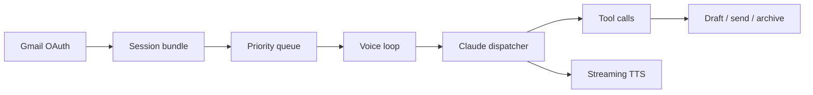

# Sage Mail

Voice-first email triage for people who need an assistant, not another inbox.

Sage reads the important email first, keeps the session to one decision at a time, drafts in the user's voice, and never sends without explicit approval.

Live: https://voice-email-app.vercel.app

## Why it matters

Most email tools make the inbox faster to scroll. Sage makes it possible to clear the inbox while walking, getting dressed, or recovering from decision fatigue. The product shape is deliberately narrow: one email, one spoken decision, one safe action.

## What it does

- Prioritizes Gmail by relationship and context: founder/business, family, Wesleyan, opportunities, vendors, friends, and unknown senders.
- Reads the email aloud, then waits for a voice decision: reply, skip, archive, hear more, revise, send, or stop.
- Drafts replies using the user's profile, memory, past messages, and thread context.
- Streams the assistant response sentence by sentence so the voice loop feels immediate.
- Leaves consequential actions gated behind approval.

## Architecture



## Stack

Next.js 16, TypeScript, Clerk, Supabase, Gmail API, Anthropic Claude, streaming server-sent events, browser speech APIs, and a shared Cortex memory/profile layer.

## Relationship to Cortex

Cortex is the broader personal-AI system: memory, profile, RAG, spheres, and agentic actions. Sage Mail is the focused shipped surface: the email agent you can actually talk to.

## Run locally

```bash
npm install
npm run dev
```

Add the required Clerk, Supabase, Gmail OAuth, and Anthropic environment variables in `.env.local`.
